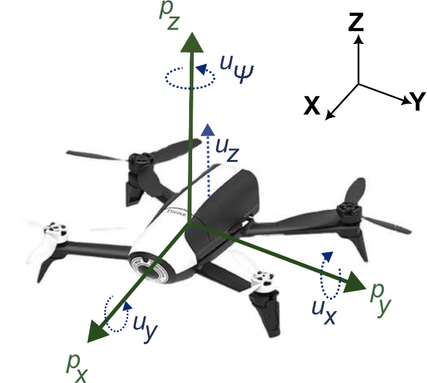

## Barrot Bebop2 Model

## Model Structure

We propose the following structure to describe the position dynamics of the Barrot Bebop2:

$$
\begin{aligned}
\dot{x}=A_c x+B_c u\\
\end{aligned}
$$

where $x=[p_x ~ \dot{p}_x ~ p_y ~ \dot{p}_y ~ p_z ~\dot{p}_z ]^\top$

and $u=[u_x\\ 
        u_y\\
        u_z]^\top$. 

With $p_x,p_y,p_z \in \mathbb{R}$ are $X$, $Y$, and $Z$ positions of the drone in the global Cartesian coordinate system, and $u_x, u_y, u_z \in \mathbb{R}$ are control inputs on $X$, $Y$, and $Z$ directions. In this framework:
- $u_x$ is the pitch angle (in radians),
- $u_y$ is the roll angle (in radians), and
- $u_z$ is the vertical velocity (in meters/second).

See Figure [Parrot](#parrot).

The dynamical model can be expressed in state-space form with the following matrices:

$$
A_c = 
\begin{bmatrix}
0 & 1.0000 & 0 & 0 & 0 & 0 \\
0 & -0.0527 & 0 & 0 & 0 & 0 \\
0 & 0 & 0 & 1.0000 & 0 & 0 \\
0 & 0 & 0 & -0.0187 & 0 & 0 \\
0 & 0 & 0 & 0 & 0 & 1.0000 \\
0 & 0 & 0 & 0 & 0 & -1.7873
\end{bmatrix},
B_c =
\begin{bmatrix}
0 & 0 & 0 \\
-5.4779 & 0 & 0 \\
0 & 0 & 0 \\
0 & -7.0608 & 0 \\
0 & 0 & 0 \\
0 & 0 & -1.7382
\end{bmatrix}, C_c = I_6
$$

## Constraints and Parameters

- *State constraints**:  
  - Upper bound: $X.U.B = [10, 10, 2.57, 10, 10, 10]^\top$  
  - Lower bound: $X.L.B = [-10, -10, -10, -10, 0, -10]^\top$  

- **Control input constraints**:  
  - Upper bound: $U.U.B = [0.05, 0.05, 0.6]^\top$ 
  - Lower bound: $U.L.B = [-0.05, -0.05, -0.6]^\top$  

- **Sampling period**: $\Delta T = 0.2$

- **Weighting matrices**:  

$$
Q_x = 
\begin{bmatrix}
5 & 0 & 0 & 0 & 0 & 0\\
0 & 5 & 0 & 0 & 0 & 0\\
0 & 0 & 5 & 0 & 0 & 0\\
0 & 0 & 0 & 5 & 0 & 0\\
0 & 0 & 0 & 0 & 1000 & 0\\
0 & 0 & 0 & 0 & 0 & 1000
\end{bmatrix},
Q_u =
\begin{bmatrix}
35 & 0 & 0 \\
0 & 20 & 0 \\
0 & 0 & 2
\end{bmatrix}, 
$$

- **Initial state**: $x_0 = [-0.48, 0, 0.46, 0, 1.08, 0]^\top$  
- **Reference state**: $\bar{x}_r = [0, 0, 0, 0, 1.5, 0]^\top$

The system is discretized with a sampling period of $\Delta T = 0.2$, and the weighting matrices are defined as:  

